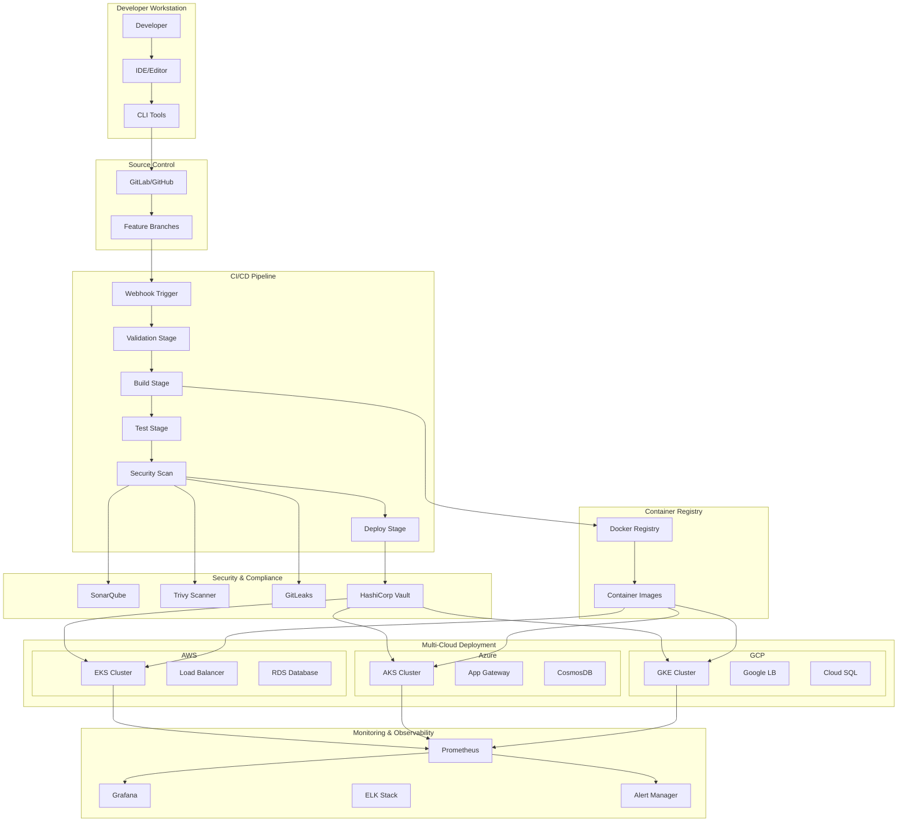
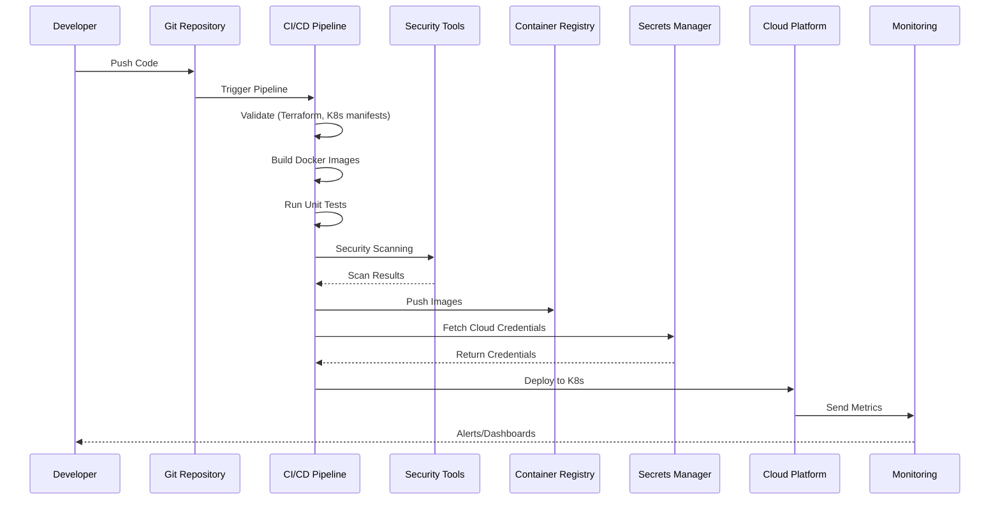
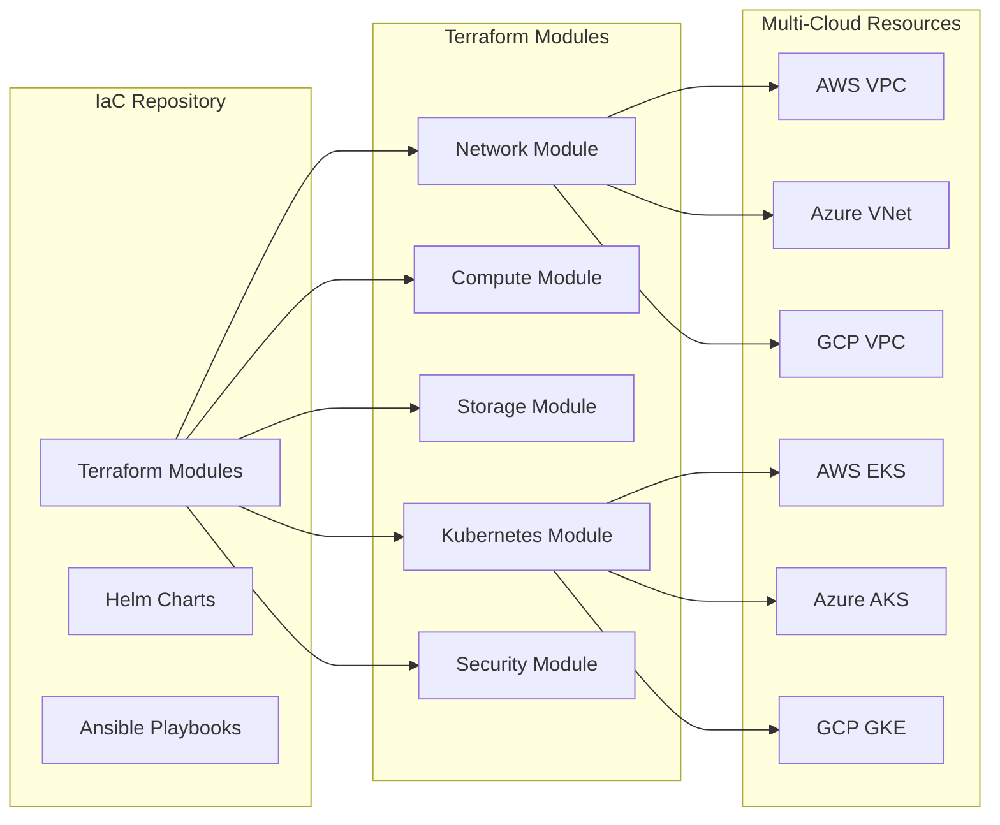
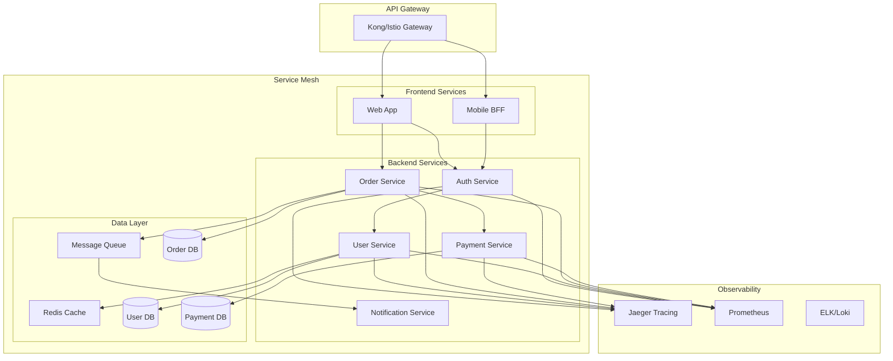
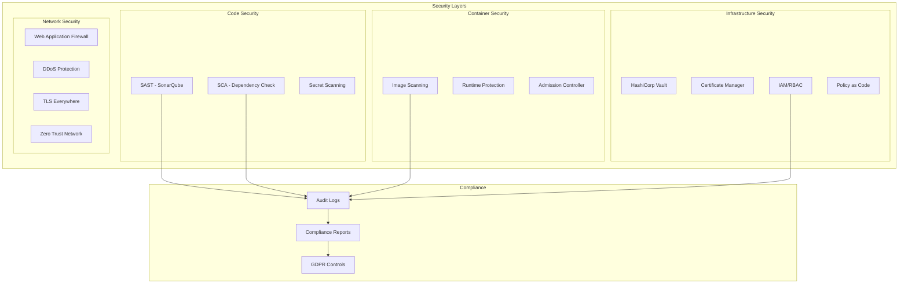
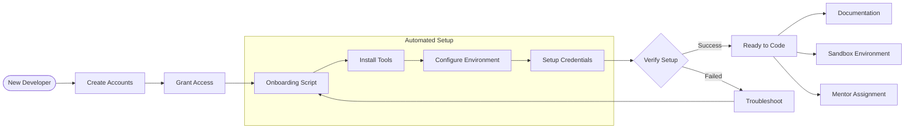

# Developer Platform Architecture

## High-Level Architecture Overview

## CI/CD Pipeline Flow

## Infrastructure as Code Architecture

## Microservices Architecture

## Security Architecture

## Developer Onboarding Flow

## Technology Stack

| Component | Technologies |
|-----------|-------------|
| **CI/CD** | GitLab CI, Jenkins, GitHub Actions |
| **IaC** | Terraform, Ansible, Helm |
| **Containers** | Docker, Kubernetes, Istio |
| **Cloud** | AWS (EKS), Azure (AKS), GCP (GKE) |
| **Security** | SonarQube, Trivy, GitLeaks, Vault |
| **Monitoring** | Prometheus, Grafana, ELK Stack |
| **Languages** | Python, Java, Go, JavaScript |
| **Databases** | PostgreSQL, MongoDB, Redis |
| **Message Queue** | RabbitMQ, Kafka |
| **API Gateway** | Kong, Istio Gateway |