# SonarQube Integration in gRPC Microservices Architecture

## 🎯 Where to Use SonarQube

### 1. **CI/CD Pipeline Integration**
SonarQube should be integrated in the GitHub Actions workflow between the **Unit Tests** and **Build Docker Image** stages:

```mermaid
graph LR
    UnitTest[🧪 Unit Tests] --> SonarQube[🔍 SonarQube Analysis]
    SonarQube --> QualityGate{Quality Gate}
    QualityGate -->|Pass| BuildImg[🏗️ Build Docker Image]
    QualityGate -->|Fail| Blocked[❌ Block Pipeline]
```



### 2. **Integration Points**

| Stage | Purpose | Action |
|-------|---------|--------|
| **Pull Request** | Early feedback | Run analysis on PR code |
| **Main Branch** | Track project health | Full analysis after merge |
| **Pre-Build** | Quality gate | Block build if quality fails |

## 📋 What SonarQube Analyzes in Your Services

### **Go API Gateway**
- Code coverage from Go tests
- Go-specific code smells
- Security vulnerabilities in Go code
- Cyclomatic complexity

### **Node.js Services (Category/Product)**
- JavaScript/TypeScript analysis
- Test coverage from Jest/Mocha
- Security vulnerabilities in dependencies
- Code duplication

### **PHP Review Service**
- PHP code quality metrics
- Security analysis
- Unit test coverage
- Code maintainability index

## 🛠️ Implementation Example

### GitHub Actions Workflow
```yaml
name: CI Pipeline

on:
  push:
    branches: [ main ]
  pull_request:
    branches: [ main ]

jobs:
  analyze:
    runs-on: ubuntu-latest
    strategy:
      matrix:
        service: [go-api-gateway, category-service, product-service, review-service]
    
    steps:
    - uses: actions/checkout@v3
      with:
        fetch-depth: 0  # Shallow clones disabled for better analysis
    
    - name: Set up service-specific environment
      run: |
        case ${{ matrix.service }} in
          go-api-gateway)
            echo "Setting up Go environment"
            ;;
          category-service|product-service)
            echo "Setting up Node.js environment"
            ;;
          review-service)
            echo "Setting up PHP environment"
            ;;
        esac
    
    - name: Run tests with coverage
      run: |
        cd microservices/${{ matrix.service }}
        case ${{ matrix.service }} in
          go-api-gateway)
            go test -coverprofile=coverage.out ./...
            ;;
          category-service|product-service)
            npm test -- --coverage
            ;;
          review-service)
            phpunit --coverage-clover=coverage.xml
            ;;
        esac
    
    - name: SonarQube Scan
      uses: SonarSource/sonarqube-scan-action@master
      env:
        GITHUB_TOKEN: ${{ secrets.GITHUB_TOKEN }}
        SONAR_TOKEN: ${{ secrets.SONAR_TOKEN }}
      with:
        args: >
          -Dsonar.projectKey=grpc-platform-${{ matrix.service }}
          -Dsonar.sources=microservices/${{ matrix.service }}
          -Dsonar.exclusions=**/vendor/**,**/node_modules/**,**/*_test.go,**/tests/**
          -Dsonar.tests=microservices/${{ matrix.service }}/tests
          -Dsonar.coverage.exclusions=**/mocks/**,**/test/**
          -Dsonar.go.coverage.reportPaths=microservices/go-api-gateway/coverage.out
          -Dsonar.javascript.lcov.reportPaths=microservices/*/coverage/lcov.info
          -Dsonar.php.coverage.reportPaths=microservices/review-service/coverage.xml
    
    - name: Quality Gate check
      uses: SonarSource/sonarqube-quality-gate-action@master
      timeout-minutes: 5
      env:
        SONAR_TOKEN: ${{ secrets.SONAR_TOKEN }}
```

## 🎨 SonarQube Project Configuration

### Project Structure in SonarQube
```
grpc-platform/
├── grpc-platform-go-api-gateway/
├── grpc-platform-category-service/
├── grpc-platform-product-service/
└── grpc-platform-review-service/
```

### Quality Profiles
- **Go**: Use "Sonar way" for Go with custom rules for gRPC
- **JavaScript**: Enhanced profile for Node.js with TypeScript support
- **PHP**: PSR-12 compliant profile with security rules

### Quality Gates
```yaml
Conditions:
  - New Code Coverage: >= 80%
  - Reliability Rating: A
  - Security Rating: A
  - Maintainability Rating: A
  - Duplicated Lines: < 3%
  - Security Hotspots Reviewed: 100%
```

## 🔧 Local Development Integration

### Pre-commit Hook
```bash
#!/bin/bash
# .git/hooks/pre-commit

# Run SonarLint locally before commit
services=("go-api-gateway" "category-service" "product-service" "review-service")

for service in "${services[@]}"; do
  echo "Running SonarLint on $service..."
  cd microservices/$service
  
  case $service in
    go-api-gateway)
      golangci-lint run
      ;;
    category-service|product-service)
      npx eslint . --ext .js,.ts
      ;;
    review-service)
      ./vendor/bin/phpcs
      ;;
  esac
  
  cd ../..
done
```

### IDE Integration
- **VS Code**: SonarLint extension for real-time feedback
- **IntelliJ**: SonarLint plugin with project binding
- **Visual Studio**: SonarLint for IDE integration

## 📊 Metrics to Track

1. **Code Quality Metrics**
   - Technical Debt Ratio
   - Code Coverage
   - Cyclomatic Complexity
   - Cognitive Complexity

2. **Security Metrics**
   - Vulnerability count
   - Security hotspots
   - OWASP compliance

3. **Maintainability Metrics**
   - Code duplication
   - Code smells
   - Documentation coverage

## 🚀 Benefits in Your Architecture

1. **Early Detection**: Catch issues before they reach production
2. **Multi-language Support**: Analyze Go, Node.js, and PHP in one platform
3. **Quality Gates**: Enforce standards across all microservices
4. **Historical Tracking**: Monitor code quality evolution
5. **Integration**: Works seamlessly with GitHub Actions and ArgoCD
6. **Developer Feedback**: Immediate feedback on pull requests

## 🔗 Integration with Other Tools

- **Vault**: Store SonarQube tokens securely
- **Prometheus**: Export SonarQube metrics for monitoring
- **Grafana**: Create dashboards for code quality trends
- **ArgoCD**: Use quality gates as deployment conditions